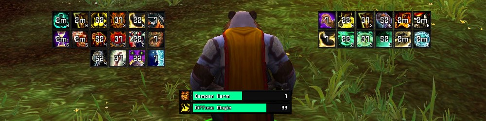

# Filger
 
 A modified version of Filger to suit my personal preferences and be compatible with [oUF_Lua](https://github.com/PedroZC90/oUF_Lua).

 Filger is a minimal buff/debuff tracker addon for [World of Warcraft](https://worldofwarcraft.com/en-us/), which allows you to keep track of any buffs/debuffs of all units (player, target, focus, etc.) and player's items/spells cooldown.

 **obs.:** Only buffs/debuffs/cooldowns specified by you that will be tracked and displayed, and each spell need to be configure by it's respective spellID.

<figure>
	<figcaption>Example: Filger ScreenShot</figcaption>
	
</figure>

## Features:

+ Track any buff/debuff on player, target, focus, pet, etc.
+ Track player spells cooldown.
+ Track player equippment (trinket, etc.) cooldown.
+ Display Type: "ICON" or "BAR"
+ Command-Line (/filger help) to record combat log and easily get spellID (see file **dev.lua**).

## Config:

All configuration can be done at file *setting.lua*. Adding classes and editing spells are done through editing the spell table *Filger.Spells*.

### Options:

+ **general:**
	+ "show" = display frames to easier positioning.
	+ "configmode" = simulate filger.
	+ "rec" = enable /filger command-line.
+ **frame:**
	+ unit: set which unit to be watched.
	+ caster: filter spell source.
		+ set caster = "all" for boss/encounter debuffs/buffs.
	+ direction: direction that elements are displayed.
		+  if you set type = "BAR", remember to set direction = "DOWN" and width = NUMBER.
	
**obs.:** Just Priest, Monk, Druid and Shaman classes have been configured.

## Info:

 **Author:** Nils Ruesch, Affli
 
 **Credits:** FourOne, Shestak, Garagar, hidekki

## License:

 Please see [LICENSE](https://github.com/PedroZC90/Filger/blob/master/LICENSE) file.