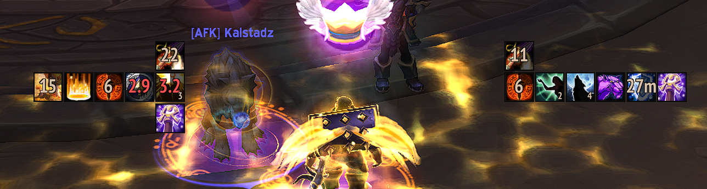

# Filger

Filger is a minimal aura tracker addon for [World of Warcraft](https://worldofwarcraft.com/en-us/).

It allows you to keep track of any buffs/debuffs of all units (player, target, focus, etc.) and player's items/spells cooldown.

    

## Dependencies

-   Required: `None`
-   Optional:
    -   [Tukui](https://github.com/tukui-org/Tukui)

## Configuration

Currently, the addon configuration is done by editing directly the [config.lua](config/config.lua).
So, for example, if you want to move the PLAYER_BUFF frame, you will need to set the coordinates (X, Y) in the lua file.

## License:

Please see [LICENSE](./LICENSE) file.
